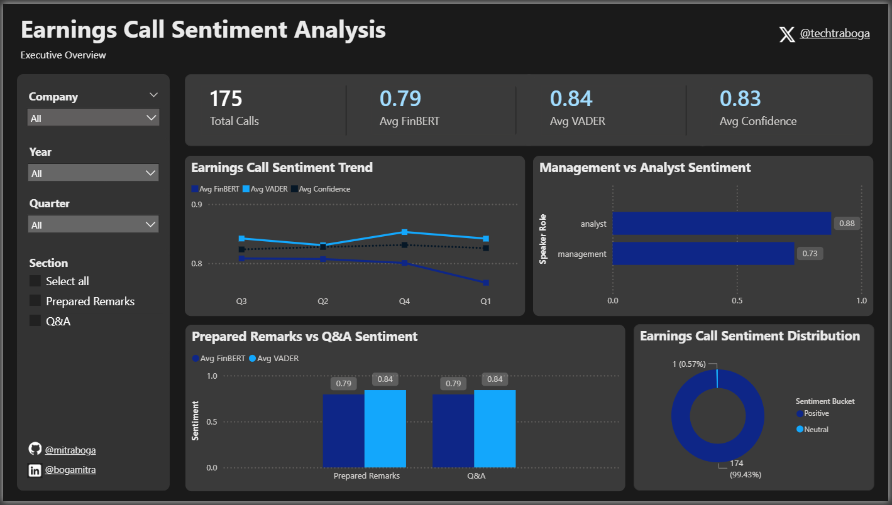
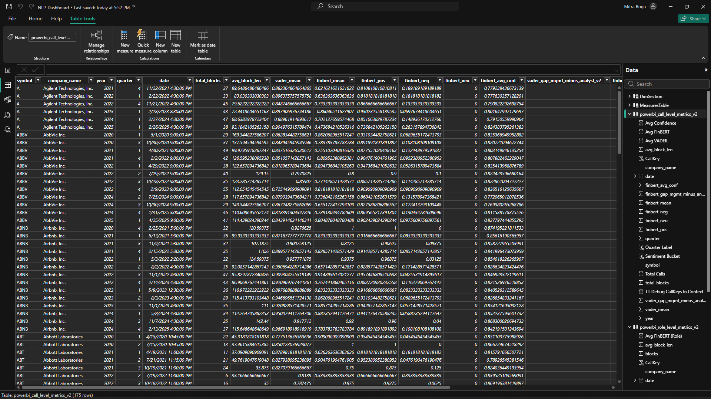
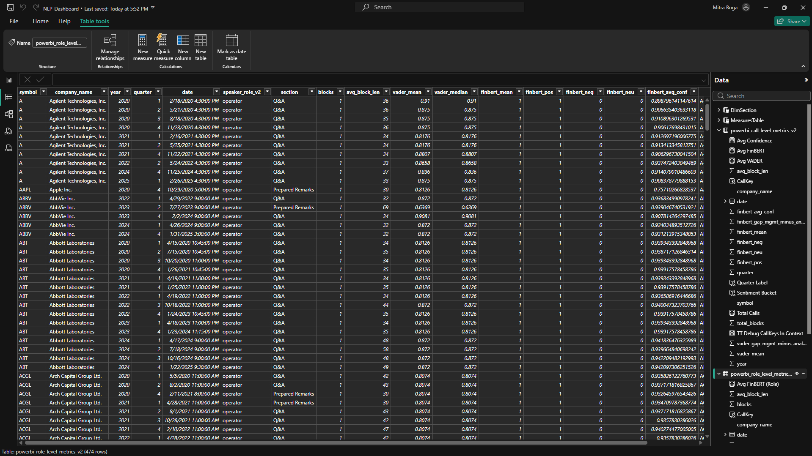
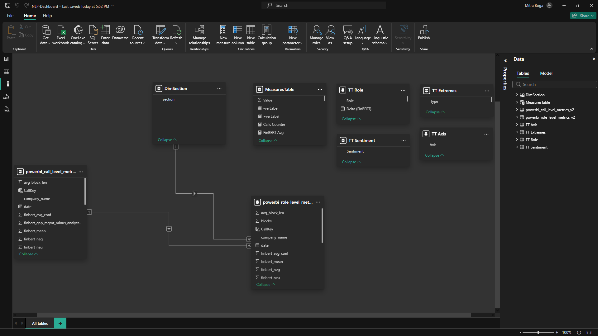
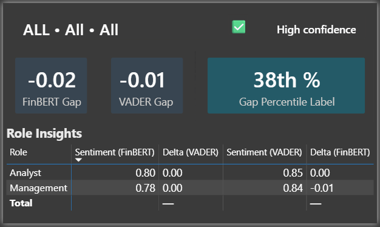
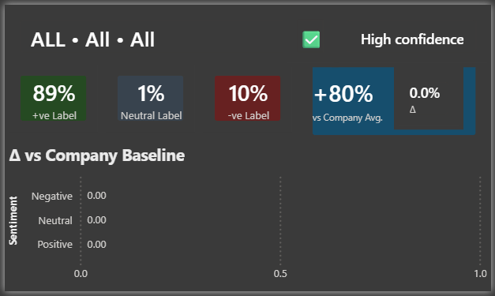
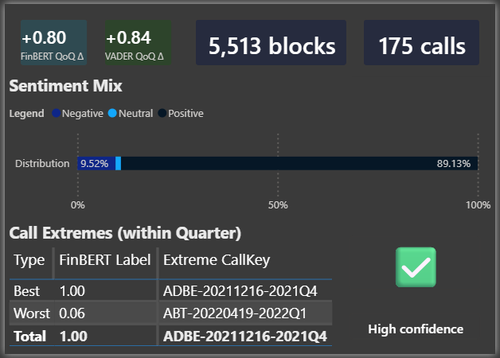
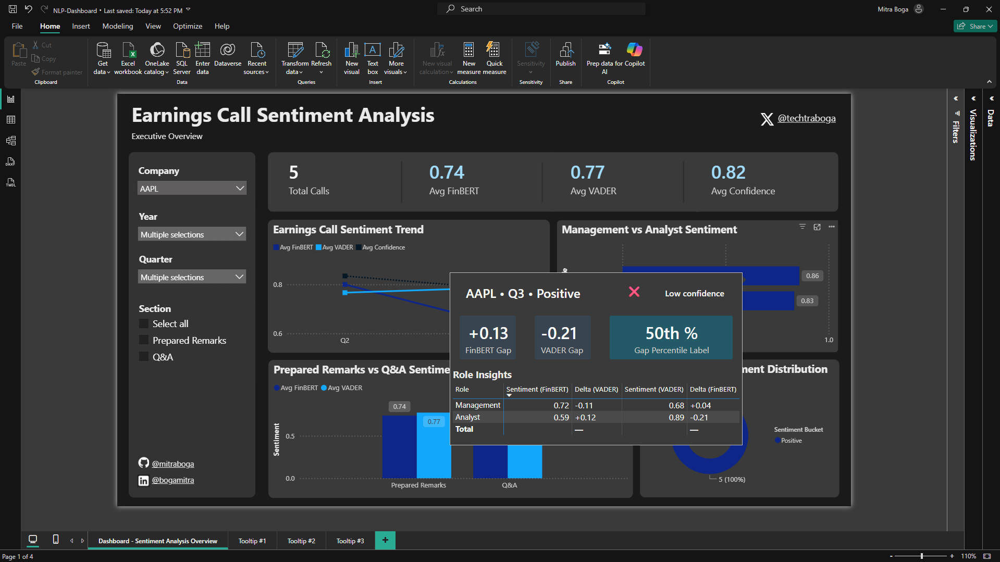
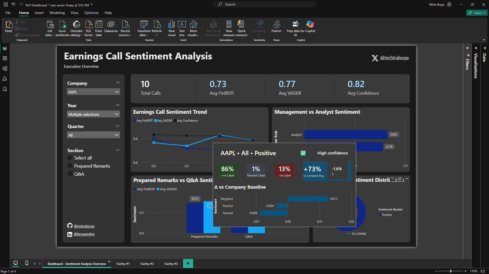
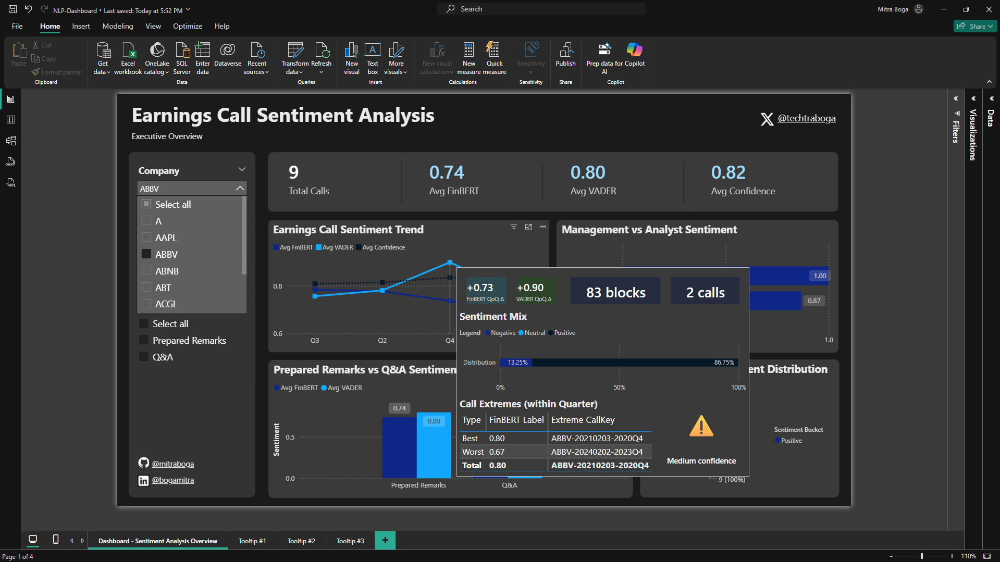

# 📞 S&P 500 Earnings Call Sentiment Analysis (VADER + FinBERT) 

Turn raw earnings-call transcripts into **decision-grade sentiment metrics** that quantify how **management, analysts, and the market narrative** evolve over time.

This repository builds an end-to-end NLP pipeline that produces:
- ✅ **Clean speaker-level text blocks**
- ✅ **Speaker role labelling** (Management / Analyst / Operator / Other)
- ✅ **Dual-model sentiment scoring**
  - **VADER** (fast, rule-based baseline)
  - **FinBERT** (finance-domain transformer)
- ✅ **Power BI-ready metrics tables**
- ✅ A Power BI dashboard: `NLP-Dashboard.pbix`

---

## Why this matters (real business impact)

Earnings calls are not “just text.” They are strategic communication events that influence:
- **Investor confidence**
- **Risk perception**
- **Market narratives**
- **Competitive positioning**

### What sentiment analysis unlocks
Sentiment scoring helps detect changes in:
- **Confidence vs caution** (tone shifting positive → neutral/negative)
- **Uncertainty language** (hedging, vague guidance)
- **Pressure dynamics** (analysts pushing back vs management defending)
- **Narrative momentum** across quarters and companies

### Real-world business advantages
These insights can support:
- **Investor Relations (IR):** refine messaging; identify where investors are unconvinced
- **Equity Research:** add consistent sentiment KPIs to qualitative call notes
- **Risk / Compliance:** flag unusually negative calls for deeper review
- **Portfolio strategy:** compare narrative trend across companies and time
- **Competitive intelligence:** benchmark management confidence vs peers

### What this proves as an NLP / AI / ML engineering project
This repo demonstrates the core value loop:

**Raw text → structured speaker blocks → model scoring → aggregated KPIs → business dashboard**

That’s exactly how NLP engineers turn unstructured language into **measurable metrics** that guide decisions. As an aspiring engineer myself, I ensured to follow this core value loop!

---

## Repo Structure (matches your actual repo)

```text
.
├── data/
│   ├── raw/
│   │   └── transcripts_raw.csv
│   └── processed/
│       ├── speaker_blocks_cleaned.csv
│       ├── speaker_blocks_with_vader.csv
│       ├── speaker_blocks_with_finbert.csv          # expected output for merge
│       ├── speaker_blocks_with_sentiment.csv
│       ├── powerbi_call_level_metrics.csv
│       ├── powerbi_role_level_metrics.csv
│       ├── preprocess_checkpoint.txt
│       └── vader_checkpoint.txt
│
├── etl/
│   ├── load_transcripts.py
│   └── preprocess_speaker_blocks.py
│
├── models/
│   ├── sentiment_vader.py
│   └── sentiment_finbert.py
│
├── features/
│   ├── merge_sentimnets.py              # filename typo is intentional (matches repo)
│   └── aggregate_for_powerbi.py
│
├── NLP-Dashboard.pbix
└── requirements.txt
```
---

## Data Source

This project uses the Hugging Face dataset:
- `kurry/sp500_earnings_transcripts`

`etl/load_transcripts.py` exports it to:
- `data/raw/transcripts_raw.csv`

---

## Setup

### 1) Create and activate a virtual environment (recommended)
Windows:
    python -m venv .venv
    .venv\Scripts\activate

macOS/Linux:
    python -m venv .venv
    source .venv/bin/activate

### 2) Install dependencies
    pip install -r requirements.txt

IMPORTANT: `etl/load_transcripts.py` uses Hugging Face `datasets`:
    from datasets import load_dataset

So install it (and ideally add it to requirements.txt):
    pip install datasets

### 3) Install spaCy model
Your preprocessing uses:
    spacy.load("en_core_web_sm", disable=["parser", "ner"])

Install:
    python -m spacy download en_core_web_sm

---

## Pipeline (Run Order)

### Step 1 — Download transcripts → data/raw/transcripts_raw.csv
    python etl/load_transcripts.py

Output:
- data/raw/transcripts_raw.csv

---

### Step 2 — Preprocess into clean speaker blocks + role inference
    python etl/preprocess_speaker_blocks.py

Outputs:
- data/processed/speaker_blocks_cleaned.csv
- data/processed/preprocess_checkpoint.txt (resume support)

What preprocessing does (technical):
- Reads raw transcripts from `data/raw/transcripts_raw.csv`
- Parses `structured_content` safely via:
  - json.loads() first
  - ast.literal_eval() fallback
- Extracts speaker blocks from common keys (segments/blocks/content/dialogue)
- Cleans text:
  - lowercasing
  - removes “forward-looking statements” and “safe harbour” sections
  - strips non-alphabet characters
  - lemmatizes with spaCy
  - removes stopwords
  - keeps alpha tokens with length > 2
- Filters low-signal blocks using:
  - MIN_BLOCK_LEN = 30 words
- Labels speaker role using keyword heuristics:
  - operator / management / analyst / other

Output schema: data/processed/speaker_blocks_cleaned.csv
- symbol
- company_name
- year
- quarter
- date
- speaker
- speaker_role
- clean_text
- block_length

---

### Step 3 — VADER sentiment scoring (baseline)
    python models/sentiment_vader.py

Outputs:
- data/processed/speaker_blocks_with_vader.csv
- data/processed/vader_checkpoint.txt

Adds:
- sentiment_vader  (compound score in [-1, 1])

Notes:
- Uses chunked processing (CHUNK_ROWS = 5000)
- Resume support via vader_checkpoint.txt
- Duplicate-protection: script stops if output exists and checkpoint is 0

---

### Step 4 — FinBERT sentiment scoring (finance transformer)
    python models/sentiment_finbert.py

Expected output (required for merge step):
- data/processed/speaker_blocks_with_finbert.csv

Required columns (used downstream):
- finbert_sentiment   (positive / neutral / negative)
- finbert_confidence  (confidence score)

IMPORTANT:
- Your merge + aggregation scripts assume the file/columns above exist.
- If your current `sentiment_finbert.py` is not producing them yet, implement/update it so it writes:
  data/processed/speaker_blocks_with_finbert.csv

---

### Step 5 — Merge VADER + FinBERT into one dataset
    python features/merge_sentimnets.py

Inputs:
- data/processed/speaker_blocks_with_vader.csv
- data/processed/speaker_blocks_with_finbert.csv

Output:
- data/processed/speaker_blocks_with_sentiment.csv

Merge method:
- strict inner join on:
  symbol, company_name, year, quarter, date,
  speaker, speaker_role, clean_text, block_length

---

## 📊 Power BI Dashboard — *Earnings Call Sentiment Analysis (Executive Overview)*

The Python pipeline produces sentiment metrics — but the **Power BI report is the “decision layer”** that makes those metrics usable in real business workflows.

This project isn’t just NLP in Python — the **Power BI layer is where raw text becomes decisions**.

The dashboard turns thousands of earnings-call speaker blocks into **executive-ready KPIs**, letting you:
- spot **sentiment shifts** over time (quarter-to-quarter),
- compare **Management vs Analyst tone** (credibility vs skepticism),
- separate **Prepared Remarks vs Q&A** (scripted vs spontaneous),
- and drill into **outliers + confidence** using purpose-built tooltips.

> **Business impact (real world):**  
> Sentiment signals can act like an “early-warning system” for guidance risk, investor expectations, PR issues, or competitive pressure — especially when **Management’s tone diverges from Analysts’ tone**.

---

## Exhibit 1 — Executive Overview (Report View)



### What the page answers (in 10 seconds)
1) **What’s the overall tone right now?**  
2) **Is sentiment improving or deteriorating over time?**  
3) **Is Management more optimistic than Analysts (or vice versa)?**  
4) **Does sentiment change when we move from scripted Prepared Remarks → spontaneous Q&A?**  
5) **What’s the distribution of positive / neutral / negative sentiment?**

### Filters (left panel)
- **Company** slicer (single or multi-select)
- **Year** slicer
- **Quarter** slicer
- **Section** slicer: **Prepared Remarks** vs **Q&A**  
  (this is critical — Q&A is where uncertainty and tension usually shows up)

### KPI Banner (top row)
The banner is the “exec summary” for the current filter context:
- **Total Calls**
- **Avg FinBERT**
- **Avg VADER**
- **Avg Confidence**

Example shown in the screenshot (AAPL):
- **Total Calls: 10**
- **Avg FinBERT: 0.73**
- **Avg VADER: 0.77**
- **Avg Confidence: 0.82**

---

## Exhibit 2 — The Data Backbone (Call-Level vs Role-Level Tables)

These are the two tables that my Python pipeline exports and my Power BI dashboard consumes:

<details>
  <summary><b>Click to expand (Tables)</b></summary>
  <br/>

  <b>Call-Level Metrics Table (one row per earnings call)</b><br/>
  
  <br/><br/>

  <b>Role-Level Metrics Table (one row per call + role + section)</b><br/>
  
</details>

### Call-Level table includes:
- volume context (**total_blocks**, **avg_block_len**)
- sentiment aggregates (**vader_mean**, **finbert_mean**)
- mix metrics (**finbert_pos / finbert_neu / finbert_neg**)
- reliability signal (**finbert_avg_conf**)
- divergence signals (**vader_gap_mgmt_minus_analyst**, **finbert_gap_mgmt_minus_analyst**)
- traceability ID (**CallKey**) used in tooltips for “best/worst call” surfacing

### Role-Level table includes:
- role splits (**Analyst / Management / Operator**)
- section splits (**Prepared Remarks / Q&A**)
- role-level sentiment means + medians (e.g., **vader_median**)
- role-level confidence

---

## Exhibit 3 — Model View (why the tooltips work)

<details>
  <summary><b>Click to expand (Relational Model)</b></summary>
  
</details>

### What’s happening here (technical, but clean)
- Two primary fact tables:
  - `powerbi_call_level_metrics_v2`
  - `powerbi_role_level_metrics_v2`
- `DimSection` supports clean filtering for **Prepared Remarks vs Q&A**
- A dedicated `MeasuresTable` centralizes KPI logic and tooltip logic
- Several small **tooltip helper tables** (TT_*) exist purely to power tooltip layouts:
  - `TT Role`, `TT Sentiment`, `TT Axis`, `TT Extremes`

This structure allows my tooltips to act as “mini dashboards” without polluting my main model's more minimal overview for a cursory analysis.

---

# ⭐ The Real Differentiator: Tooltips That Think

I built **3 tooltip pages** that activate on hover from the main dashboard.
These tooltips don’t just repeat visible charts — they provide **diagnostics**:
- role divergence
- percentile ranking
- baseline deltas vs company norm
- QoQ momentum
- call extremes (best/worst) with CallKey traceability
- confidence classification (high / medium / low)

---

## Tooltip #1 — Role Gap + Gap Percentile (Divergence Diagnostics)

<details>
  <summary><b>Click to expand (Tooltip #1)</b></summary>
  
</details>

### What it shows
- **FinBERT Gap** and **VADER Gap** (Management − Analyst)
- **Gap Percentile Label** (how extreme the divergence is)
- A **Role Insights** table that breaks down:
  - `Sentiment (FinBERT)`
  - `Sentiment (VADER)`
  - `Delta (VADER)`
  - `Delta (FinBERT)`
- Confidence badge:
  - ✅ **High confidence**
  - ⚠️ **Medium confidence**
  - ❌ **Low confidence**

Example shown:
- **FinBERT Gap = -0.02**
- **VADER Gap = -0.01**
- **Gap Percentile Label = 38th%**
- Analyst vs Management (FinBERT): **0.80 vs 0.78**
- Analyst vs Management (VADER): **0.85 vs 0.84**
- Confidence: ✅ **High confidence**

### Why it matters (business)
A divergence between Management and Analysts can signal:
- credibility gaps,
- skepticism in Q&A,
- uncertainty not reflected in scripted remarks,
- narrative management vs fundamentals.

---

## Tooltip #2 — Sentiment Mix + “Δ vs Company Baseline”

<details>
  <summary><b>Click to expand (Tooltip #2)</b></summary>
  
</details>

### What it shows
- Distribution cards:
  - **+ve Label**
  - **Neutral Label**
  - **-ve Label**
- Benchmarking cards:
  - **vs Company Avg.**
  - **Δ** (change vs baseline)
- A mini chart: **Δ vs Company Baseline**
  (how the current context differs from the company’s normal tone)

Example shown:
- **+ve Label: 86%**
- **Neutral Label: 1%**
- **-ve Label: 13%**
- **+73% vs Company Avg.**
- Baseline deltas show directionality by bucket:
  - Positive: **+0.013**
  - Negative: **-0.004**
  - Neutral: **-0.009**

### Why it matters (business)
This prevents the classic analytics mistake:
> “This quarter is positive”  
instead of  
> “This quarter is positive **relative to this company’s baseline behavior**.”

It tells you if the tone is *actually unusual* or just “business as usual” for that company.

---

## Tooltip #3 — QoQ Momentum + Call Extremes (Best/Worst CallKey)

<details>
  <summary><b>Click to expand (Tooltip #3)</b></summary>
  
</details>

### What it shows
- Momentum cards:
  - **FinBERT QoQ Δ**
  - **VADER QoQ Δ**
- Scale context:
  - **blocks**
  - **calls**
- **Sentiment Mix** stacked bar (Negative / Neutral / Positive)
- **Call Extremes (within Quarter)**:
  - `Best` + `Worst` surfaced using **Extreme CallKey**
  - includes FinBERT label strength + traceability

Example shown:
- **FinBERT QoQ Δ: +0.80**
- **VADER QoQ Δ: +0.84**
- **5,513 blocks**
- **175 calls**
- Call Extremes:
  - Best: **ADBE-20211216-2021Q4** (FinBERT Label: **1.00**)
  - Worst: **ABT-20220419-2022Q1** (FinBERT Label: **0.06**)
- Confidence: ✅ **High confidence**

### Why it matters (business)
This is the “so what?” tooltip:
- what changed (QoQ),
- how strong the change is (distribution),
- and which calls created the movement (extremes).

---

# 🖱️ Tooltips in Action (Interaction Proof)

These three screenshots show the tooltips activating directly from the Executive Overview page.

<details>
  <summary><b>Click to expand (Tables)</b></summary>
  <br/>

  <b>Call-Level Metrics Table (one row per earnings call)</b><br/>
  
  <br/><br/>

  <b>Role-Level Metrics Table (one row per call + role + section)</b><br/>
  

  <b>Role-Level Metrics Table (one row per call + role + section)</b><br/>
  
</details>

### What these “money shots” prove (to recruiters + stakeholders)
- The dashboard is **not static** — it’s interactive and context-aware.
- Hovering passes filter context into tooltip pages (company/quarter/section/sentiment bucket).
- The tooltips behave like **mini dashboards**:
  - Example (AAPL • Q3 • Positive): ❌ **Low confidence**
    - **FinBERT Gap: +0.13**
    - **VADER Gap: -0.21**
    - **Gap Percentile: 50th%**
    - Role matrix shows cross-model disagreement patterns (FinBERT vs VADER).
  - Example (ABBV): ⚠️ **Medium confidence**
    - **FinBERT QoQ Δ: +0.73**
    - **VADER QoQ Δ: +0.90**
    - **83 blocks**, **2 calls**
    - Extremes surfaced via CallKey:
      - Best: **ABBV-20210203-2020Q4** (0.80)
      - Worst: **ABBV-20240202-2023Q4** (0.67)

---

## ⚡ Key Insights You Can Pull in 60 Seconds (How to *actually* use this)

Use these as “executive questions” — each one maps directly to a slicer + a visual + a tooltip.

### 1) “Is sentiment trending up or down — and is it reliable?”
- **Where to look:** KPI Banner + **Earnings Call Sentiment Trend**
- **What to check:**  
  - Avg FinBERT / Avg VADER direction over time  
  - **Avg Confidence** (high confidence = signal, low confidence = caution)

### 2) “Is Management’s optimism aligned with Analyst skepticism?”
- **Where to look:** **Management vs Analyst Sentiment** bar chart  
- **Then hover:** **Tooltip #1 (Role Gap + Percentile)**
- **What to check:**  
  - **FinBERT Gap** + **VADER Gap** (Mgmt − Analyst)  
  - **Gap Percentile Label** (is the divergence extreme or normal?)

### 3) “Does the tone shift when the script ends?”
- **Where to look:** **Prepared Remarks vs Q&A** comparison chart  
- **How:** toggle **Section** slicer (Prepared Remarks vs Q&A)
- **What to check:**  
  - If Q&A sentiment drops while Prepared stays high → potential uncertainty / pressure.

### 4) “Is this quarter ‘good’… or just normal for this company?”
- **Where to look:** Hover any relevant context → **Tooltip #2 (Δ vs Company Baseline)**
- **What to check:**  
  - **+ve / Neutral / -ve Label** percentages  
  - **vs Company Avg.** uplift  
  - Baseline deltas by bucket (Positive/Neutral/Negative)

### 5) “What changed quarter-over-quarter (momentum), and what drove it?”
- **Where to look:** Hover the trend or quarter context → **Tooltip #3 (QoQ Δ + Extremes)**
- **What to check:**  
  - **FinBERT QoQ Δ** and **VADER QoQ Δ**  
  - **blocks** + **calls** (sample size)  
  - **Call Extremes (Best/Worst CallKey)** to identify the exact calls moving the metric

### 6) “Are the models agreeing or disagreeing?”
- **Where to look:** **Tooltip #1 Role Insights table**
- **What to check:**  
  - If FinBERT is strongly positive but VADER is negative (or vice versa), treat as a **language-style edge case**  
  - Use the **confidence badge** (High/Medium/Low) to decide whether to trust the label

### 7) “Are we seeing a ‘confidence problem’ (noisy signal)?”
- **Where to look:** KPI Banner (**Avg Confidence**) + tooltip confidence badges  
- **What to check:**  
  - If confidence is low, prefer directional trends + larger sample contexts  
  - Use **blocks/calls** (Tooltip #3) as a sanity check

### 8) “Which quarter/company should I investigate first?”
- **Where to look:** Trend line + **Tooltip #3 extremes**
- **How to decide quickly:**  
  - pick the quarter with the biggest QoQ swing  
  - confirm it has enough blocks/calls  
  - grab the **Worst CallKey** and review the transcript context for that call

---

## ✅ How to Use the Dashboard (1-minute guide)

1. Pick a **Company** (or compare multiple).
2. Filter by **Year / Quarter**.
3. Toggle **Prepared Remarks vs Q&A** for “scripted vs real”.
4. Hover any key visual to open **tooltips**:
   - Role Gap diagnostics
   - Baseline deltas vs company norm
   - QoQ change + best/worst calls
5. Use the tooltip insights to answer:
   - “Is sentiment moving?”
   - “Is leadership credibility aligned with analysts?”
   - “Where are the outliers and how confident are we?”

This report is designed with one goal:

> **Keep the main page clean and executive-friendly — push the deep diagnostics into interactive tooltips.**

---

## Checkpointing (resume support)

Built for long runs + safe interruption:
- data/processed/preprocess_checkpoint.txt
- data/processed/vader_checkpoint.txt

If interrupted (CTRL+C), rerun the script to resume from the last checkpoint.

---

## Troubleshooting

spaCy model missing:
- Error: Can't find model 'en_core_web_sm'
- Fix:
    python -m spacy download en_core_web_sm

Hugging Face datasets missing:
- Error: No module named 'datasets'
- Fix:
    pip install datasets

VADER duplicate protection:
- If you want a clean rebuild, delete:
  - data/processed/speaker_blocks_with_vader.csv
  - data/processed/vader_checkpoint.txt

---

## Author
Mitra Boga
